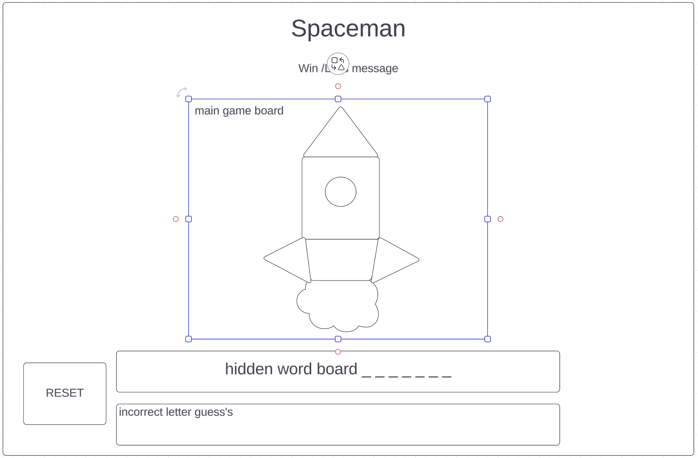
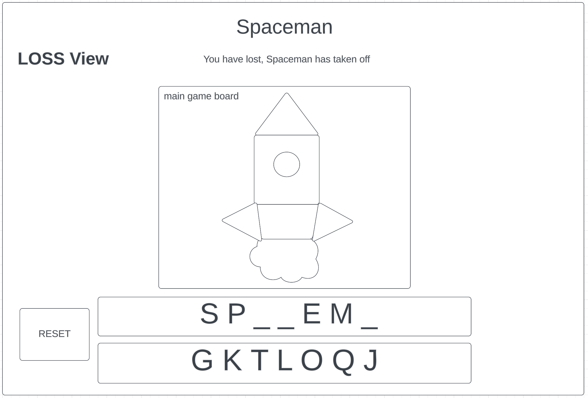
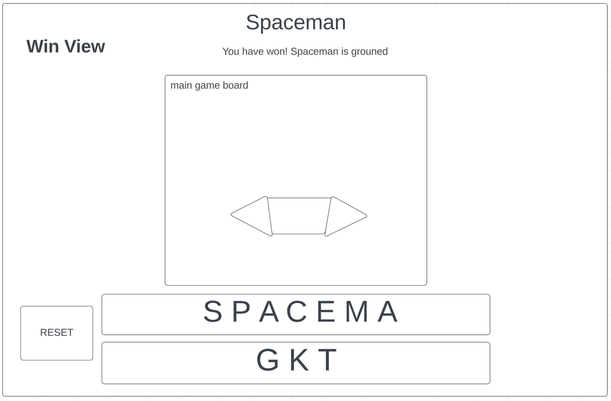
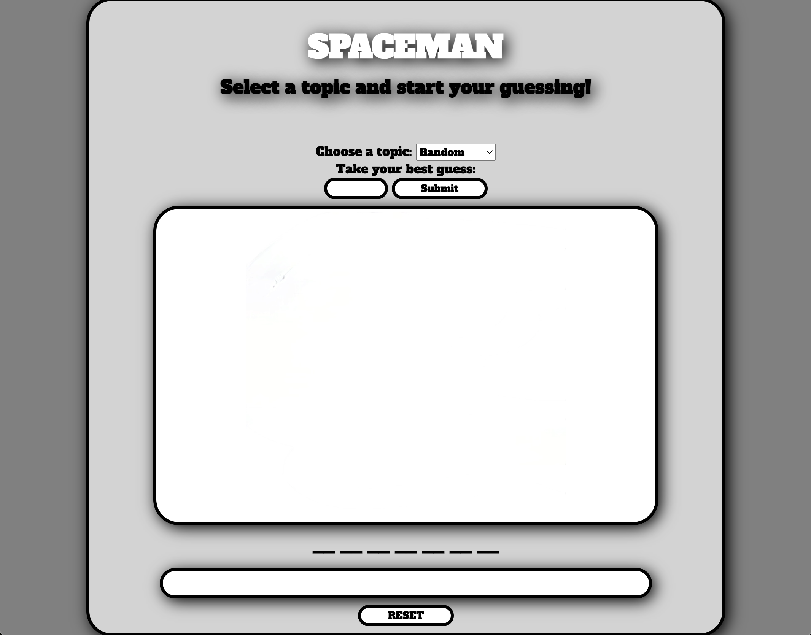
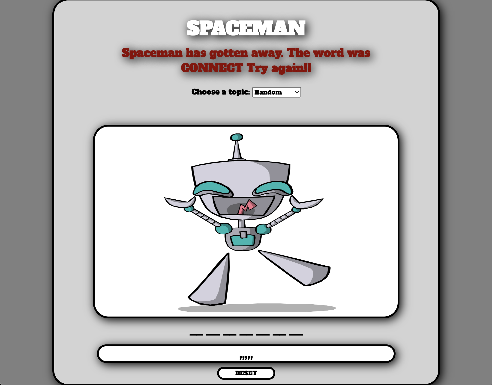
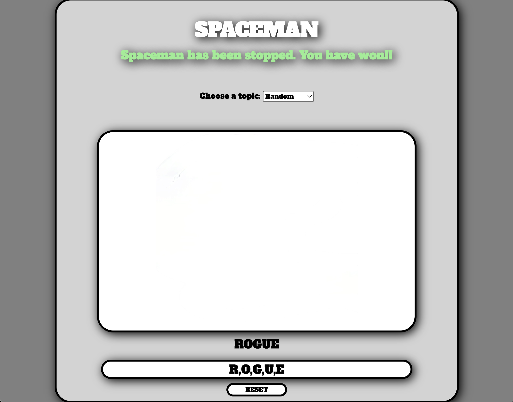

# game title
SPACEMAN

# spaceman
Spaceman is a friendly version of hangman. In this game a spaceship/spaceman is built as incorrect guesses occur (max of 6). If the player makes too many incorrect guesses the spaceship takes off. The player wins the game by completing the word with guesses still available. 

## Wireframes
 
 



# Images to display to the DOM

- to be added

## User Stories
- As a user, I want to...
- have a reset button (game will load with a current word)
- have a area to input the guess
- have a area to display incorrect guesses
- have a area for the hidden word
- when a letter is guessed correctly it will appear in its word location
- know how many guesses I have left
- know when I have won the game
- know when I have lost the game

## Technologies Used
- HTML5
- CSS3
- JavaScript

##### Font
```css
font-family: Arial, Helvetica, sans-serif;

```

## Psuedocode

1) Define required constants
    - word choices

2) Define required variables used to track the state of the game
    - winner
    - letter choice
    - random word

3) Store elements on the page that will be accessed in code more than once in variables to make code more concise, readable and performant.
    - letters guessed
    - letters correct

4) Upon loading the app should:
  4.1) Initialize the state variables
  4.2) Render those values to the page
  4.3) Wait for the user to enter a letter


5) Handle a player entering a letter

6) Render based on correct/incorrect

7) Handle a player clicking the reset button

## Finished Game Images

 
 



## Next Steps

1) Force the input box to always have focus for txt

2) Additional CSS to spice it up

3) Better images for the Spaceman

4) Take notice of blank space and duplicate letters and prevent them

5) Incorrect guess counter